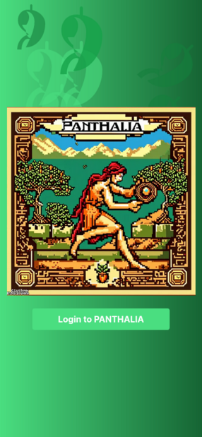
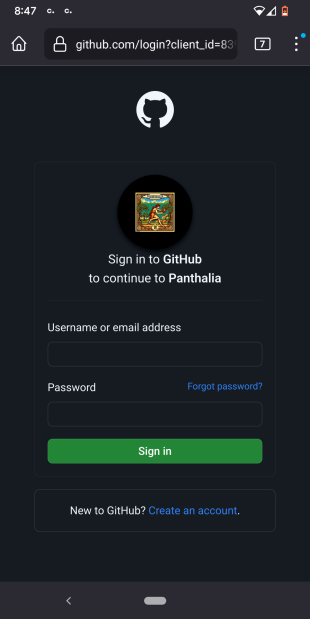
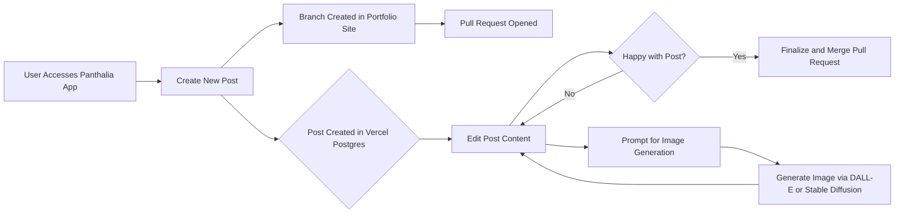

# Panthalia 🌎👁️‍🗨️ 🎨 🖋️🚶

> Panthalia (/panˈTHālēə/) combines the Greek roots pan- ("all"), thalia ("Muse of comedy and idyllic poetry"). The intended meaning is "flourishing or creating everywhere." 

## Overview

Panthalia is a homebrewed blog post accelerator system. It is very much tightly coupled to the architecture of my blog and the manner in which I compose blog posts. While it leverages some "AI" services, the main purpose of the project *is not* to have AI take 
over authoring blog posts for me or in my style. 

**Panthalia enables me to kick-off blog posts as quickly as I can think of ideas for new posts** - and gives me the option to either see production all the way through on my phone, or return to the pull request opened by Panthalia once I'm back at a laptop or desktop.

## Available anywhere - but only for me

A mobile-first experience             | For me and only me 
:-------------------------:|:-------------------------:
 | 

This app is currently for me, and for me alone. I am the sole GitHub user who can log into it. It exposes a streamlined mobile-friendly 
interface that I can hit from my phone or any other odd mobile device wherever I might be. 

## Mobile form-factor - but unlimited creative potential

Everything I could normally build into one of my blog posts on my favorite work laptop is now available on my phone.

The mobile interface is simple but powerful - because I intentionally built my blog around the MDX file format - I can write complete blog posts including images, videos and links - while also generating 
any arbitrary images for both the "leader" or "hero" image that's shown on the blog post's index page - as well as an arbitrary number of additional images of any kind that I can slot into a blog post body. 

I wired up a Markdown "What you see is what you get" (WYSIWYG) editor for my content - so I can also include rich elements such as my newsletter subscription widget, for example. 

## Image generation

A couple of months ago, I started experimenting with using StableDiffusion generated images for my blog posts. I'm especially fond of generating pixel-art style images - and I found a great Discord that runs several bots allowing you to generate images on demand - but (reasonably) with 
some rate limits around generation. I wanted to remove that limitation for myself and set myself up with a reliable pipeline for unlimited image generation. 

Panthalia accomplishes this by connecting up to StableDiffusionXL (SDXL) running on Replicate - a pretty sweet service that lets you call all manner of machine learnings models via REST API calls. 

The leader image prompt is generated asynchronously in the background, as are any other number of images I requested on initial post submission. When I hit my edit post page, all of the images generated for that post 
are displayed. Images can be "rejected" - meaning I don't like them for some reason or they're borked - and they'll be deleted simultaneously in the database and S3. 

Images can also be accepted - those are separately saved to the same branch as the blog post and pushed up to GitHub. 

## Pull requests, branch updates and Vercel preview deployments

Panthalia immediately opens a pull request for every new post submission I create - because, at least for me, writing is an iterative process. I usually have the blocks of content roughly arrayed in my mind before I start writing, so I'll hammer those out and submit. That results in Panthalia 
cloning my portfolio repository, creating a unique branch, adding my new post in the right place, committing and pushing it to GitHub and then using the GitHub API to open a pull request. 

Since my portfolio / blog site is hosted on Vercel, I get deployment previews for free in this workflow, which are also ideal for review on mobile. I can easily start a new post, take a look at it via my pull request's preview URL, then edit that post via Panthalia and submit several more updates 
which will end up pushed on the same branch - resulting in a new Vercel preview deployment with my latest changes. 

Once back at my laptop, posts can be polished and their pull requests merged to publish them live on my blog. For many blog posts, the above loop is sufficiently powerful for me to author and publish them live - start to finish - because merging the pull request results in a live deployment to [https://zackproser.com](https://zackproser.com).

## Architecture, philosophy and challenges

Panthalia is built to be extremely responsive and to handle all long-running tasks asynchronously. When I submit the new post form, the new post is accepted and the API route immediately returns - allowing me to either continue editing other posts 
or to fire off another several. 

Panthalia is deployed to Vercel and leveraging Vercel's Postgres offering, but all asynchronous work is done in a "fire and forget" fashion - my API routes accept work like new posts or post edits, but kick off other API route calls to handle the long-running work such as: 

Running on Vercel introduced some interesting challenges: for example, using git for this app was core to the architecture and workflows, but you cannot install arbitrary packages on Vercel functions, such as git. I was able to leverage the excellent isomorphic-git package 
which re-implements core git functionality in pure JavaScript that works both on the client and server. 

* Cloning my portfolio repository which contains my app 
* Calling out to my StableDiffusion endpoint, which is served by Replicate - 
* Saving the image files generated by Replicate to AWS S3 (which is necessary because Replicate's URLs that host generated images are only valid for 1 hour - to save on their own storage costs)
* Re-generating images at my request - which is so far a normal part of using StableDiffusion as your image generator when building content for the web (in my experience)
* Saving durable image URLs returned from S3 to Postgres
* Committing the generated images I do like to my portfolio site on the same branch as the original pull request so that I can reference them from my markdown updates

Together this enables a streamlined mobile-first blogging workflow resulting in high quality published posts, while allowing me to quickly stub out and start posts whenever and wherever they occur to me.

## Why? 

I get a lot of ideas for blog posts I want to write - especially if I'm out and about, walking around or doing something away from my usual laptop - which is optimized for crafting blog posts comprised of images, videos, etc. 

The idea behind Panthalia is - instead of writing myself notes in markdown into my second brain in Obsidian, just to copy them out later and turn them into posts - instead just create the pull requests against my portfolio repository 
which contains my blog. 

My hope is that by lowering the friction to publish a full blog post, I can fire off the initial pull requests for my next 5 posts from my phone while waiting in line somewhere - up to and including using Stable Diffusion to generate my 
blog post images - which I've been [doing lately](https://www.zackproser.com/blog/first-see-if-youve-got-the-bug) and [really enjoying](https://www.zackproser.com/blog/i-am-joining-pinecone-io). 

## How does it work?

## Features

### Basics

* ✅ Expose a responsive web / mobile app 
* ✅ Create new blog posts by providing a title, summary, content and some optional image prompts
* ✅ Save draft (in-progress) posts to PostgreSQL
* ✅ Provide a form for editing in-progress posts on a mobile phone 
* ✅ After creating a new post and pull request, the pull request URL and the branch should be saved to the post's record

### AI integration 

* ✅ Use a Stable Diffusion microservice (running on Replicate) for "leader image" generation, using the posts's image prompts
* ✅ Generated images are saved to S3 for temporary storage so they can be pulled back and reviewed while editing a post
* ✅ Generated leader images stored in S3 are saved to the images table with an associated post ID so that they can be retrieved during post editing
* Edit form supports generating multiple images simultaneously
* Consider training OpenAI's GPT-4 model to review the draft post to ensure it's inline with the style of my existing blog posts, which would assist in Iterating while on the go. This could be potentially be another chat textarea on the edit post form

### Iterating on a post

* ✅ The edit form should be aware of an existing branch and push any changes up on that same branch as additional commits
* The edit form should allow re-generating or deletion of images
* The edit form should allow for images the user is happy with to be committed and pushed on the same branch as the open pull request, so that they can be referenced in the blog post body via Next.js `<Image>`elements.

### Automation 

* ✅ A pull request to my personal portfolio site, whose source lives at github.com/zackproser/portfolio, is opened programmatically 
* ✅ Pull requests that are opened are saved to the database and associated with the post they contain 

## Stack 
* Next.js
* Vercel

## Installation

Clone the repo

`git clone https://github.com/zackproser/panthalia.git`

Install NPM packages

`npm install`

### Configure environment variables

Copy the .env.example file to .env and supply your PostgreSQL credentials and other API keys.

### Start the dev server

`npm run dev`

Open http://localhost:3000 to view the app.

## Database operations 

### Drop an old posts table 

Hit `localhost:3000/api/drop-posts-table`

### Create the posts table 

Hit `localhost:3000/api/create-posts-table`

### Optionally, seed the posts table

The `create-posts-table` route accepts an optional query string parameter `seed_db`. 

If you hit `localhost:3000/api/create-posts-table?seed_db=true`, the posts table will be seeded with dummy data (some initial posts).

