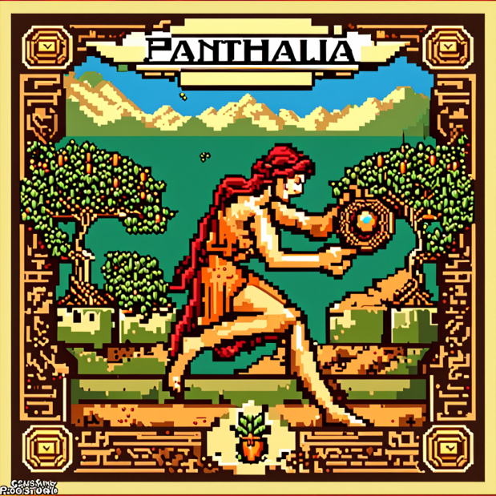
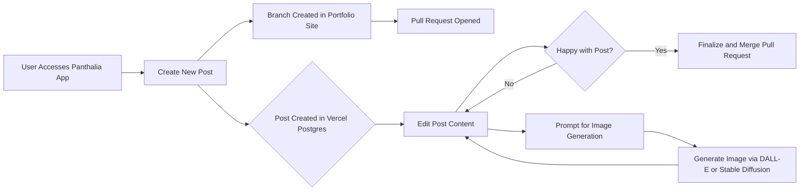

# Panthalia 🌎👁️‍🗨️ 🎨 🖋️

> Panthalia (/panˈTHālēə/) combines the Greek roots pan- ("all"), thalia ("Muse of comedy and idyllic poetry"). The intended meaning is "flourishing or creating everywhere." 

## Overview
The goal of this project is to enable quickly authoring and iterating on blog posts on the go from my phone. This results in pull requests on GitHub, which generate Vercel deployment previews to review on mobile. When back at a computer, posts can be polished up and published on a live blog.

The project will also explore and leverage AI services for automatic image generation based on prompts.

Together this enables a streamlined mobile-first blogging workflow resulting in high quality published posts, while allowing me to quickly stub out and start posts whenever and wherever they occur to me.

## Features

### Basics

* ✅ Expose a responsive web / mobile app 
* ✅ Create new blog posts by providing a title, summary, content and some optional image prompts
* ✅ Save draft (in-progress) posts to PostgreSQL
* ✅ Provide a form for editing in-progress posts on a mobile phone 
* After creating a new post and pull request, the pull request URL and the branch should be saved to the post's record

### AI integration 

* Use either DALL-E or a Stable Diffusion microservice for image generation, using the posts's image prompts
* Consider training OpenAI's GPT-4 model to review the draft post to ensure it's inline with the style of my existing blog posts, which would assist in Iterating while on the go. This could be potentially be another chat textarea on the edit post form

### Iterating on a post

* The edit form should be aware of an existing branch and push any changes up on that same branch as additional commits
* The edit form should allow re-generating or deletion of images
* The edit form should allow drag and drop of generated images between paragraphs of text

### Automation 

* ✅ A pull request to my personal portfolio site, whose source lives at github.com/zackproser/portfolio, is opened programmatically 
* The Vercel preview URL that is generated by the pull request is saved to the database and available as a link on each post's card in the index view

## Stack 
* Next.js
* Vercel

## Installation

Clone the repo

`git clone https://github.com/zackproser/panthalia.git`

Install NPM packages

`npm install`

### Configure environment variables

Copy the .env.example file to .env and supply your PostgreSQL credentials and other API keys.

### Start the dev server

`npm run dev`

Open http://localhost:3000 to view the app.

